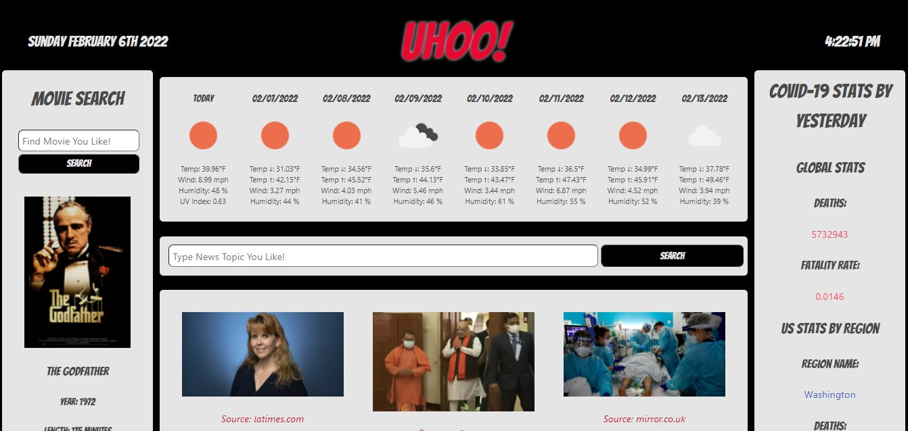

# UHOO

UHOO would like to help the User simplifly their daily information and place it all in one location.

## UHOO Offers:

* Weather Based on Current Location Pulled From the User's IP Address

* News Events Searchable by Topic

* Searchable Movie Information Based on Key Words

* World COVID-19 Statistics for The Previous Day

* Use of Multiple Server-Side APIs

## UHOO Benefits:

* Instead of the User overloading themselves with multiple applications throughout their day and using excess device memory. UHOO has tried centeralize all the information the User may need in one application.

## Preview

The following image demonstrates the web application's default appearance and functionality:

## 📝 Live URL

* [UHOO](https://kcaseychamberlain.github.io/uhoo/)